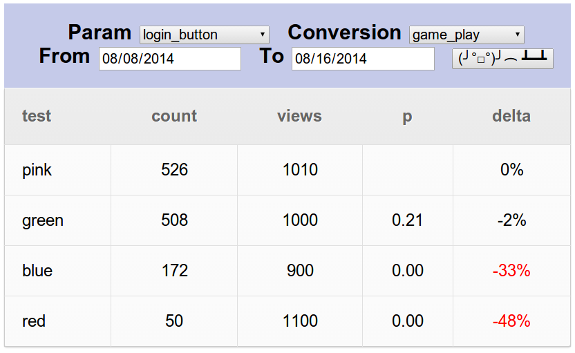

# Flak Cannon Client [](https://drone.io/github.com/claydotio/flak-cannon-client/latest)



## Install

```sh
$ npm install
$ npm run build
```

## Start

Make sure the [Flak Cannon Server](https://github.com/claydotio/flak-cannon)
is running somewhere.  
`FC_API_URL` should be the path to the server

```sh
NODE_ENV=production FC_API_URL=http://localhost:3001 npm start
```

## Contributing

### Install pre-commit hook

`ln -s ../../pre-commit.sh .git/hooks/pre-commit`

### Commands

  - `npm run dev` - Start the debug server, watching files
  - `npm run mock` - Start the debug server, mocking server requests via `src/coffee/mock.coffee`
  - `npm test` - Run the test suite (opens Chrome and Firefox)
  - `npm start` - Start the debug server, serving from ./build
  - `NODE_ENV=production npm start` - Start the debug server, serving from ./dist
  - `npm run build` - Compiles + Minifies assets -> ./dist

### Dev Environment

##### Editor: Atom.io

> Plugins
  - Stylus
  - editorconfig
  - linter
  - linter-coffeelint

##### Google Chrome

> Plugins
  - [fb-flo](https://chrome.google.com/webstore/detail/fb-flo/ahkfhobdidabddlalamkkiafpipdfchp?hl=en)
